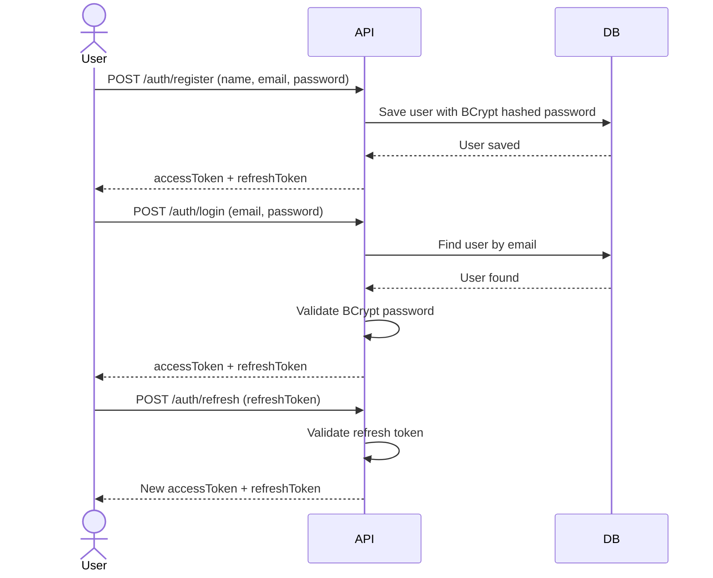
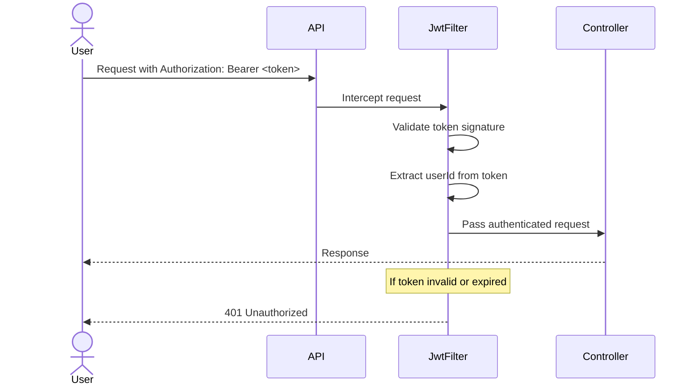
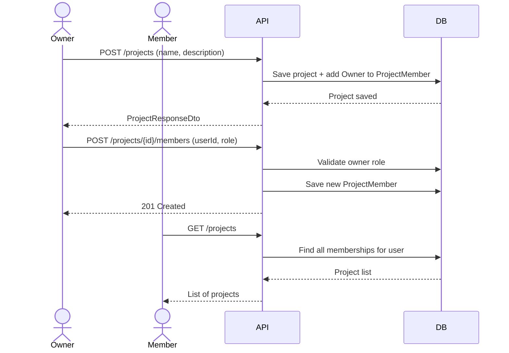
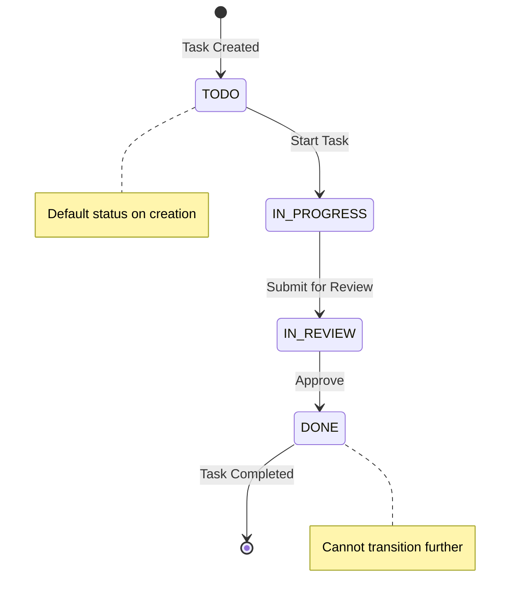
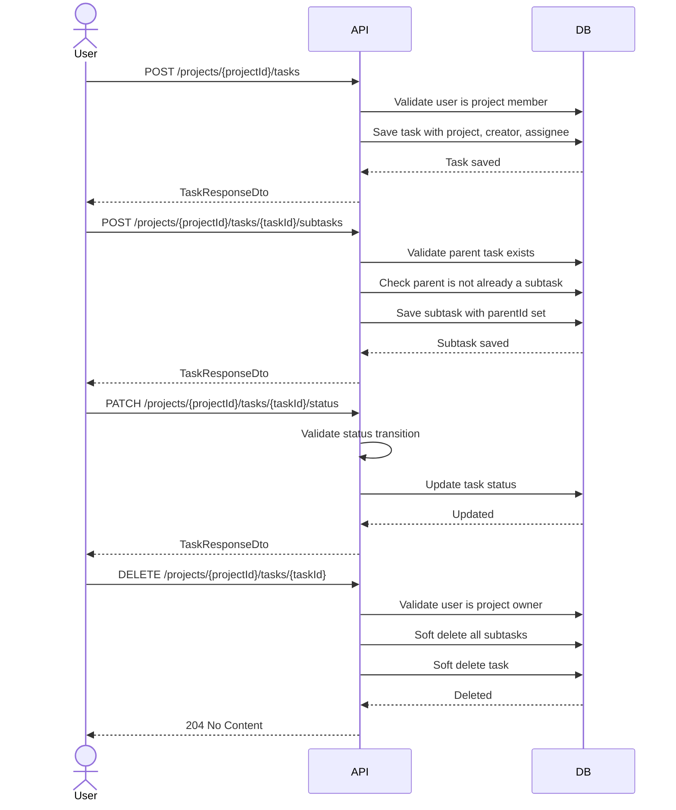
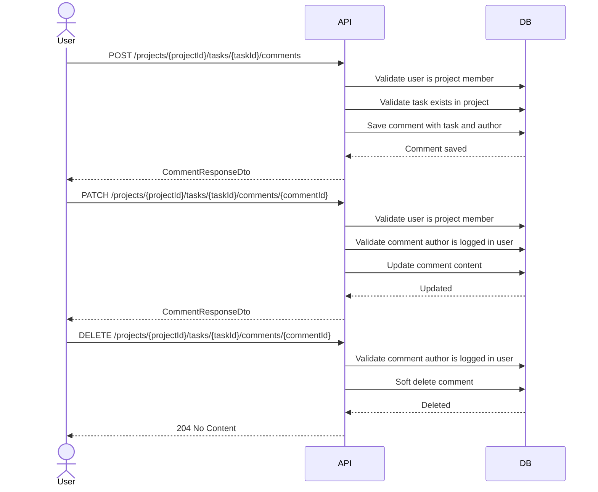
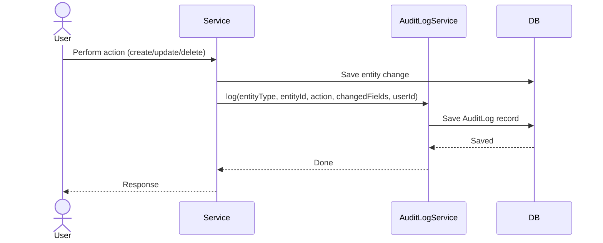
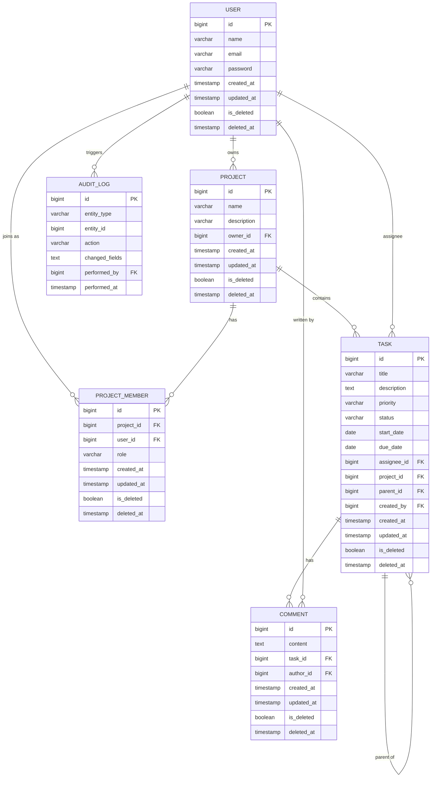
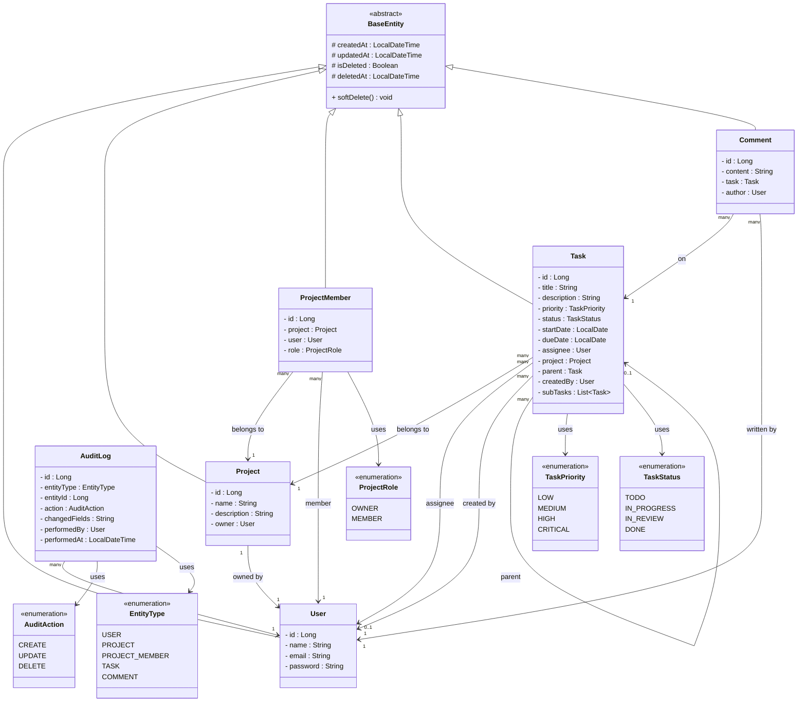

# TaskFlow


> A secure, multi-user project and task management REST API built with Spring Boot.

---

## Table of Contents

1. [Abstract](#1-abstract)
2. [Tech Stack](#2-tech-stack)
3. [Requirements](#3-requirements)
4. [Project Flow](#4-project-flow)
5. [Database Design](#5-database-design)
6. [Class Diagram](#6-class-diagram)
7. [API Design](#7-api-design)
8. [Getting Started](#8-getting-started)
9. [Project Structure](#9-project-structure)

---

## 1. Abstract

TaskFlow is a RESTful backend application developed using Spring Boot, designed to support
collaborative project and task management across multiple users. The system provides JWT-based
authentication and stateless session management, enabling secure access control where project
ownership and membership roles determine what each user can see and do.

Users can create projects, invite members, and manage tasks with full lifecycle support —
including priority levels, status transitions, start and due dates, assignee tracking,
subtasks, and comments. All entities support soft deletion, preserving data integrity while
allowing recovery. Every state change is captured in a structured audit log, providing full
traceability of who changed what and when.

The application uses PostgreSQL as its primary database, with Spring Data JPA handling all
persistence and relationship management. A global exception handling layer ensures consistent
and meaningful error responses across all endpoints. The architecture is intentionally layered
and modular, designed to accommodate future extensions such as Redis caching, Kafka-based
event streaming, and an organizational hierarchy layer without structural changes to the
existing codebase.

---

## 2. Tech Stack

| Technology | Version | Purpose |
|---|---|---|
| Java | 25 | Core programming language |
| Spring Boot | 4.0.6 | Application framework and auto-configuration |
| Spring Web | 4.0.6 | REST API layer, controllers, request/response handling |
| Spring Security | 4.0.6 | JWT authentication, role-based access control |
| Spring Data JPA | 4.0.6 | ORM, repositories, entity relationships |
| PostgreSQL | 16 | Primary relational database |
| MapStruct | 1.5.5 | DTO mapping between entity and response layers |
| Lombok | Latest | Boilerplate reduction |
| jjwt | 0.12.6 | JWT token generation and validation |
| Jackson | 2.18.2 | JSON serialization and deserialization |
| Gradle | 8.x | Build tool and dependency management |

---

## 3. Requirements

### Authentication & User Management
- A user can register with their name, email, and password.
- A user can log in and receive a JWT access token.
- A user can refresh their expired access token.
- A user can view their own profile.
- A user can update their own profile.

### Projects
- A user can create a project and automatically becomes its Owner.
- An Owner can update or soft delete their project.
- An Owner can invite another user to their project as a Member.
- An Owner can remove a Member from their project.
- An Owner can promote a Member to Owner.
- A Member can view projects they belong to.
- A Member cannot delete or update a project.

### Tasks
- An Owner or Member can create a task inside a project they belong to.
- A task must have a title, priority, status, start date, and due date.
- A task can be assigned to any Member of the same project.
- An Owner or Member can update a task.
- An Owner can delete a task (soft delete).
- A task status can only transition: `TODO` → `IN_PROGRESS` → `IN_REVIEW` → `DONE`.
- A user can filter tasks by status, priority, and assignee.
- A user can sort tasks by created date or updated date.

### Subtasks
- An Owner or Member can create a subtask under an existing task.
- A subtask follows the same fields as a task.
- A subtask cannot have its own subtask (one level deep maximum).
- An Owner can delete a subtask (soft delete).
- Deleting a task automatically soft deletes all its subtasks.

### Comments
- An Owner or Member can add a comment on a task or subtask.
- A user can edit their own comment.
- A user can delete their own comment (soft delete).

### Audit Log
- Every create, update, and delete action on any entity is recorded.
- The audit log captures entity type, entity ID, action, changed fields, user, and timestamp.
- The audit log is read-only — no user can modify or delete entries.

---

## 4. Project Flow

### 4.1 Authentication Flow



### 4.2 JWT Token Lifecycle



### 4.3 Project & Member Flow



### 4.4 Task Lifecycle



### 4.5 Task & Subtask Flow



### 4.6 Comment Flow



### 4.7 Audit Log Flow



---

## 5. Database Design

### 5.1 Entity Design

#### BaseEntity *(inherited by all entities except AuditLog)*

| Field | Type | Notes |
|---|---|---|
| `createdAt` | LocalDateTime | Auto-set on creation |
| `updatedAt` | LocalDateTime | Auto-updated on every save |
| `isDeleted` | Boolean | Default false |
| `deletedAt` | LocalDateTime | Null until soft deleted |

#### User

| Field | Type | Notes |
|---|---|---|
| `id` | Long (PK) | Auto-generated |
| `name` | String | Full name |
| `email` | String | Unique, used for login |
| `password` | String | BCrypt hashed |

#### Project

| Field | Type | Notes |
|---|---|---|
| `id` | Long (PK) | Auto-generated |
| `name` | String | Project name |
| `description` | String | Optional |
| `owner` | User (FK) | User who created the project |

#### ProjectMember

| Field | Type | Notes |
|---|---|---|
| `id` | Long (PK) | Auto-generated |
| `project` | Project (FK) | Reference to project |
| `user` | User (FK) | Reference to user |
| `role` | Enum | OWNER, MEMBER — default MEMBER |

#### Task

| Field | Type | Notes |
|---|---|---|
| `id` | Long (PK) | Auto-generated |
| `title` | String | Task title |
| `description` | String | Optional |
| `priority` | Enum | LOW, MEDIUM, HIGH, CRITICAL |
| `status` | Enum | TODO, IN_PROGRESS, IN_REVIEW, DONE |
| `startDate` | LocalDate | Planned start date |
| `dueDate` | LocalDate | Deadline |
| `assignee` | User (FK) | Nullable — user responsible |
| `project` | Project (FK) | Project this task belongs to |
| `parent` | Task (FK) | Null for root tasks, set for subtasks |
| `createdBy` | User (FK) | User who created the task |

#### Comment

| Field | Type | Notes |
|---|---|---|
| `id` | Long (PK) | Auto-generated |
| `content` | String (TEXT) | Comment body |
| `task` | Task (FK) | Works for both tasks and subtasks |
| `author` | User (FK) | User who wrote the comment |

#### AuditLog *(does not extend BaseEntity)*

| Field | Type | Notes |
|---|---|---|
| `id` | Long (PK) | Auto-generated |
| `entityType` | Enum | TASK, PROJECT, COMMENT, USER, PROJECT_MEMBER |
| `entityId` | Long | ID of affected entity |
| `action` | Enum | CREATE, UPDATE, DELETE |
| `changedFields` | String (JSON) | Snapshot of changed fields |
| `performedBy` | User (FK) | User who triggered the action |
| `performedAt` | LocalDateTime | Exact timestamp |

### 5.2 ERD Diagram



---

## 6. Class Diagram



---

## 7. API Design

> **Base URL:** `/api/v1`
> **Auth:** All protected routes require `Authorization: Bearer <accessToken>`

---

### 7.1 Authentication

| Method | Endpoint | Auth | Description |
|---|---|---|---|
| `POST` | `/auth/register` | None | Register new user |
| `POST` | `/auth/login` | None | Login and get tokens |
| `POST` | `/auth/refresh` | None | Refresh access token |

#### POST `/auth/register`
```json
{
  "name": "string",
  "email": "string",
  "password": "string"
}
```
**Response `201`**
```json
{
  "accessToken": "string",
  "refreshToken": "string",
  "tokenType": "Bearer"
}
```

#### POST `/auth/login`
```json
{
  "email": "string",
  "password": "string"
}
```
**Response `200`**
```json
{
  "accessToken": "string",
  "refreshToken": "string",
  "tokenType": "Bearer"
}
```

#### POST `/auth/refresh`
```json
"your_refresh_token"
```
**Response `200`**
```json
{
  "accessToken": "string",
  "refreshToken": "string"
}
```

---

### 7.2 User

| Method | Endpoint | Auth | Description |
|---|---|---|---|
| `GET` | `/users/profile` | Bearer Token | Get own profile |
| `PATCH` | `/users/profile` | Bearer Token | Update own profile |

#### GET `/users/profile`
**Response `200`**
```json
{
  "id": 1,
  "name": "string",
  "email": "string",
  "createdAt": "datetime"
}
```

#### PATCH `/users/profile`
```json
{
  "name": "string",
  "password": "string"
}
```
**Response `200`**
```json
{
  "id": 1,
  "name": "string",
  "email": "string",
  "updatedAt": "datetime"
}
```

---

### 7.3 Project

| Method | Endpoint | Auth | Description |
|---|---|---|---|
| `POST` | `/projects` | Bearer Token | Create project |
| `GET` | `/projects` | Bearer Token | Get all projects |
| `GET` | `/projects/{projectId}` | Bearer Token | Get project by ID |
| `PATCH` | `/projects/{projectId}` | Bearer Token (OWNER) | Update project |
| `DELETE` | `/projects/{projectId}` | Bearer Token (OWNER) | Delete project |
| `POST` | `/projects/{projectId}/members` | Bearer Token (OWNER) | Add member |
| `PATCH` | `/projects/{projectId}/members/{memberId}` | Bearer Token (OWNER) | Update member role |
| `DELETE` | `/projects/{projectId}/members/{memberId}` | Bearer Token (OWNER) | Remove member |

#### POST `/projects`
```json
{
  "name": "string",
  "description": "string"
}
```
**Response `201`**
```json
{
  "id": 1,
  "name": "string",
  "description": "string",
  "owner": {
    "id": 1,
    "name": "string",
    "email": "string"
  },
  "createdAt": "datetime"
}
```

#### POST `/projects/{projectId}/members`
```json
{
  "userId": 2,
  "role": "MEMBER"
}
```
**Response `201`**

#### PATCH `/projects/{projectId}/members/{memberId}`
```json
{
  "role": "OWNER"
}
```
**Response `200`**

---

### 7.4 Task

| Method | Endpoint | Auth | Description |
|---|---|---|---|
| `POST` | `/projects/{projectId}/tasks` | Bearer Token | Create task |
| `GET` | `/projects/{projectId}/tasks` | Bearer Token | Get all tasks |
| `GET` | `/projects/{projectId}/tasks/{taskId}` | Bearer Token | Get task by ID |
| `PATCH` | `/projects/{projectId}/tasks/{taskId}` | Bearer Token | Update task |
| `PATCH` | `/projects/{projectId}/tasks/{taskId}/status` | Bearer Token | Update task status |
| `DELETE` | `/projects/{projectId}/tasks/{taskId}` | Bearer Token (OWNER) | Delete task |

#### POST `/projects/{projectId}/tasks`
```json
{
  "title": "string",
  "description": "string",
  "priority": "HIGH",
  "status": "TODO",
  "startDate": "2026-06-01",
  "dueDate": "2026-06-15",
  "assigneeId": 1
}
```
**Response `201`**
```json
{
  "id": 1,
  "title": "string",
  "description": "string",
  "priority": "HIGH",
  "status": "TODO",
  "startDate": "2026-06-01",
  "dueDate": "2026-06-15",
  "assigneeId": 1,
  "assigneeName": "string",
  "projectId": 1,
  "createdBy": 1,
  "subTasks": [],
  "createdAt": "datetime",
  "updatedAt": "datetime"
}
```

#### GET `/projects/{projectId}/tasks`
```
Query params:
?page=0&size=10
?sortBy=createdAt&order=desc
?status=TODO
?priority=HIGH
?assigneeId=1
```

#### PATCH `/projects/{projectId}/tasks/{taskId}/status`
```json
{
  "status": "IN_PROGRESS"
}
```
> Status transitions: `TODO` → `IN_PROGRESS` → `IN_REVIEW` → `DONE`

---

### 7.5 Subtask

| Method | Endpoint | Auth | Description |
|---|---|---|---|
| `POST` | `/projects/{projectId}/tasks/{taskId}/subtasks` | Bearer Token | Create subtask |
| `GET` | `/projects/{projectId}/tasks/{taskId}/subtasks` | Bearer Token | Get all subtasks |
| `PATCH` | `/projects/{projectId}/tasks/{taskId}/subtasks/{subtaskId}` | Bearer Token | Update subtask |
| `DELETE` | `/projects/{projectId}/tasks/{taskId}/subtasks/{subtaskId}` | Bearer Token (OWNER) | Delete subtask |

#### POST `/projects/{projectId}/tasks/{taskId}/subtasks`
```json
{
  "title": "string",
  "description": "string",
  "priority": "MEDIUM",
  "status": "TODO",
  "startDate": "2026-06-01",
  "dueDate": "2026-06-10",
  "assigneeId": 1
}
```
**Response `201`**

---

### 7.6 Comments

| Method | Endpoint | Auth | Description |
|---|---|---|---|
| `POST` | `/projects/{projectId}/tasks/{taskId}/comments` | Bearer Token | Add comment |
| `GET` | `/projects/{projectId}/tasks/{taskId}/comments` | Bearer Token | Get all comments |
| `PATCH` | `/projects/{projectId}/tasks/{taskId}/comments/{commentId}` | Bearer Token (Author) | Update comment |
| `DELETE` | `/projects/{projectId}/tasks/{taskId}/comments/{commentId}` | Bearer Token (Author) | Delete comment |

#### POST `/projects/{projectId}/tasks/{taskId}/comments`
```json
{
  "content": "string"
}
```
**Response `201`**
```json
{
  "id": 1,
  "content": "string",
  "authorId": 1,
  "authorName": "string",
  "taskId": 1,
  "createdAt": "datetime",
  "updatedAt": "datetime"
}
```

---

### 7.7 Audit Log

| Method | Endpoint | Auth | Description |
|---|---|---|---|
| `GET` | `/audit-logs` | Bearer Token | Get all audit logs |
| `GET` | `/audit-logs/{entityType}/{entityId}` | Bearer Token | Get logs by entity |

#### GET `/audit-logs`
```
Query params:
?entityType=TASK
?action=UPDATE
?performedBy=1
?page=0&size=10
```
**Response `200`**
```json
{
  "content": [
    {
      "id": 1,
      "entityType": "TASK",
      "entityId": 1,
      "action": "UPDATE",
      "changedFields": "{\"title\":{\"old\":\"old title\",\"new\":\"new title\"}}",
      "performedBy": 1,
      "performedAt": "datetime"
    }
  ],
  "totalElements": 50,
  "totalPages": 5,
  "page": 0
}
```

#### GET `/audit-logs/{entityType}/{entityId}`
```
Example: /api/v1/audit-logs/TASK/1
         /api/v1/audit-logs/PROJECT/1
         /api/v1/audit-logs/COMMENT/1
```

---

## 8. Getting Started

### 8.1 Prerequisites

Make sure you have the following installed:

- [Java 25](https://openjdk.org/)
- [PostgreSQL 16](https://www.postgresql.org/)
- [Gradle 8.x](https://gradle.org/)
- [Git](https://git-scm.com/)

---

### 8.2 Installation

**1. Clone the repository**
```bash
git clone https://github.com/yourusername/taskflow.git
cd taskflow
```

**2. Create PostgreSQL database**
```sql
CREATE DATABASE taskflow;
```

**3. Configure environment**

Create `application-local.properties` in `src/main/resources/`:

```properties
spring.datasource.url=jdbc:postgresql://localhost:5432/taskflow
spring.datasource.username=your_db_username
spring.datasource.password=your_db_password

jwt.secret=your_jwt_secret_minimum_32_characters
jwt.expiration.access=900000
jwt.expiration.refresh=604800000
```

---

### 8.3 Running the Application

**Using Gradle:**
```bash
./gradlew bootRun --args='--spring.profiles.active=local'
```

**Using IntelliJ:**
- Open Run/Debug Configurations
- Set Active Profiles to `local`
- Click Run

**Application runs on:**
```
http://localhost:8080/api/v1
```

---

## 9. Project Structure

```
src/main/java/com/taskflow/
├── audit/
│   ├── AuditLog.java
│   ├── AuditLogRepository.java
│   ├── AuditLogService.java
│   ├── AuditLogController.java
│   └── dto/
│       └── AuditLogResponseDto.java
├── comment/
│   ├── Comment.java
│   ├── CommentRepository.java
│   ├── CommentMapper.java
│   ├── CommentService.java
│   ├── CommentController.java
│   └── dto/
│       ├── CommentRequestDto.java
│       └── CommentResponseDto.java
├── common/
│   ├── BaseEntity.java
│   ├── JsonUtil.java
│   ├── enums/
│   │   ├── AuditAction.java
│   │   ├── EntityType.java
│   │   ├── ProjectRole.java
│   │   ├── TaskPriority.java
│   │   └── TaskStatus.java
│   └── exception/
│       ├── AppException.java
│       └── GlobalExceptionHandler.java
├── project/
│   ├── Project.java
│   ├── ProjectMember.java
│   ├── ProjectRepository.java
│   ├── ProjectMemberRepository.java
│   ├── ProjectMapper.java
│   ├── ProjectService.java
│   ├── ProjectController.java
│   └── dto/
│       ├── MemberRequestDto.java
│       ├── MemberUpdateDto.java
│       ├── OwnerDto.java
│       ├── ProjectRequestDto.java
│       ├── ProjectResponseDto.java
│       └── ProjectUpdateDto.java
├── security/
│   ├── JwtFilter.java
│   ├── JwtUtil.java
│   ├── SecurityConfig.java
│   └── UserDetailsServiceImpl.java
├── task/
│   ├── Task.java
│   ├── TaskRepository.java
│   ├── TaskMapper.java
│   ├── TaskService.java
│   ├── TaskController.java
│   └── dto/
│       ├── TaskRequestDto.java
│       ├── TaskResponseDto.java
│       ├── TaskStatusUpdateDto.java
│       └── TaskUpdateDto.java
├── user/
│   ├── User.java
│   ├── UserRepository.java
│   ├── UserMapper.java
│   ├── UserService.java
│   ├── UserController.java
│   ├── AuthService.java
│   ├── AuthController.java
│   └── dto/
│       ├── AuthResponseDto.java
│       ├── LoginRequestDto.java
│       ├── RegisterRequestDto.java
│       ├── UserResponseDto.java
│       └── UserUpdateDto.java
└── TaskflowApplication.java

src/main/resources/
├── application.properties
└── application-local.properties  ← not committed to Git
```

---

## License

This project is licensed under the MIT License.